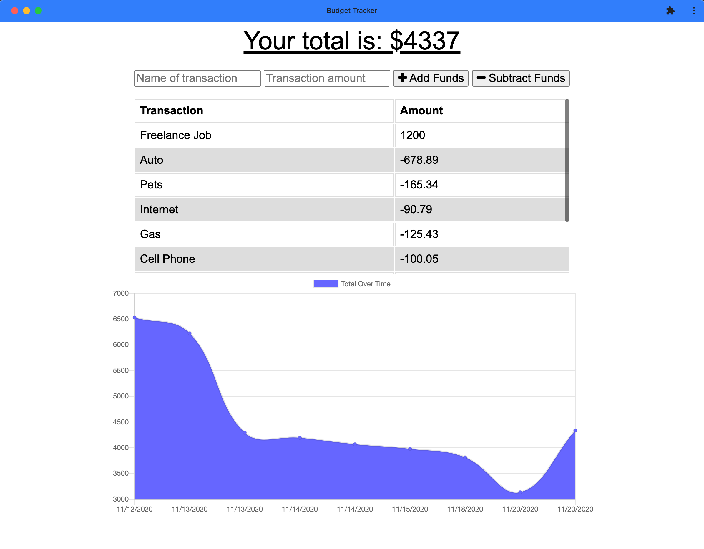

 
# Project name : BUDGET TRACKER
## Live project site can be acces here: 	[HW-18 BUDGET TRACKER](https://hw18-budget-tracker.herokuapp.com/)

## Project Repo [hw18-budget-tracker](https://github.com/trilambda122/hw18-budget-tracker)

---
## Table of Contents

[Description](#description)...

[Installation Requirements](#installtion-requirments)...

[Useage](#useage)...

[License](#License)...

[Contribitors](#Contribitors)...

[Tests](#Tests)...

[Questions](#Questions)...

[Application Screen Shots](#ScreenShots)...

---
## Description
Simple Budget tracking app using chart.js for graphing. Utilizing Atlas/MongoDB and Heroku hosting 
Application is set up as an installable PWA and will function offline 

---

## Installtion requirments
npm install

---
## Useage
npm start
If you woul like to clean the database and seed it. Run node /seeders/seed.js

---
## License
NOTICE This application is covered under MIT License license.

---
## Contribitors 

Shane Schilling

---
## Tests

---
## Questions

Github profile can be found here:  http://github.com/trilambda122

Please direct any additonal questions to: shane@sschilling.com

---
## ScreenShots

*SCREEN SHOT 1*

